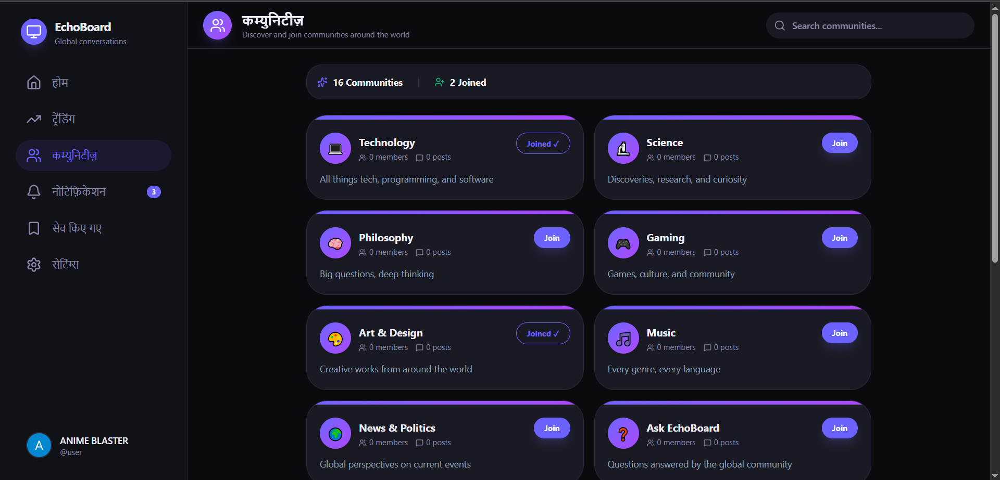

<div align="center">

# 🌐 EchoBoard

**Every voice. Every language. One conversation.**

*The first social platform with real-time translation and deep cultural context.*


[](https://react.dev)
[](https://vitejs.dev)
[](https://supabase.com)
[](https://clerk.com)
[](https://tailwindcss.com)
[](LICENSE)

[Live Demo](https://echoboard-nu.vercel.app/) · [Report Bug](../../issues) · [Request Feature](../../issues) ·  [Video](https://youtu.be/xL6YKzt9NkY)

</div>

---

## ✨ Features

| Feature | Description |
|---|---|
| 🌍 **Real-Time Translation** | Write in your native language — the world reads in theirs. Powered by a 3-API fallback chain (MyMemory → LibreTranslate → Lingva) |
| 🔐 **Authentication** | Secure sign-in/sign-up via Clerk with social logins (Google, GitHub) |
| 💬 **Threaded Discussions** | Create posts, comment, and engage in deep threaded conversations |
| ⬆️ **Voting System** | Upvote/downvote posts with one-click toggle and visual feedback |
| 🏘️ **Communities** | Discover, join, and post to topic-based communities |
| 🔥 **Trending** | See the most upvoted posts with time-based filters (Today, This Week, All Time) |
| 🔔 **Smart Notifications** | Real-time alerts for upvotes, comments, and new community posts |
| 🌓 **Dark/Light Mode** | Premium dark theme by default with a light mode toggle |
| 📱 **Fully Responsive** | Mobile bottom nav, hamburger menu, and adaptive layouts |
| 🔖 **Saved Posts** | Bookmark posts and auto-save when upvoting |
| 🌐 **9 Languages** | UI translated into English, Spanish, French, German, Japanese, Korean, Chinese, Italian, and Hindi |

---

## 📸 Screenshots

<div align="center">

| Desktop Feed | Communities | Mobile View |
|---|---|---|
|  |  |  |

</div>

---

## 🛠️ Tech Stack

```
Frontend:    React 19 + Vite 7
Styling:     Tailwind CSS 4
Auth:        Clerk
Database:    Supabase (PostgreSQL + Realtime)
Translation: MyMemory / LibreTranslate / Lingva APIs
i18n:        i18next + react-i18next
Icons:       Lucide React
Routing:     React Router v7
```

---

## 🚀 Quick Start

### Prerequisites

- [Node.js](https://nodejs.org/) 18+
- [Supabase](https://supabase.com) project (free tier)
- [Clerk](https://clerk.com) application (free tier)

### 1. Clone the repository

```bash
git clone https://github.com/YOUR_USERNAME/Echo-Board.git
cd Echo-Board
```

### 2. Install dependencies

```bash
npm install
```

### 3. Set up environment variables

Create a `.env` file in the root directory:

```env
VITE_SUPABASE_URL=your_supabase_project_url
VITE_SUPABASE_ANON_KEY=your_supabase_anon_key
VITE_CLERK_PUBLISHABLE_KEY=your_clerk_publishable_key
```

> ⚠️ **Never commit your `.env` file!** It's already in `.gitignore`.

### 4. Set up Supabase tables

Run these SQL commands in your Supabase SQL Editor:

```sql
-- Profiles table
CREATE TABLE profiles (
  id TEXT PRIMARY KEY,
  username TEXT,
  avatar_url TEXT,
  bio TEXT,
  created_at TIMESTAMPTZ DEFAULT NOW()
);

-- Communities table
CREATE TABLE communities (
  id UUID PRIMARY KEY DEFAULT gen_random_uuid(),
  name TEXT NOT NULL,
  description TEXT,
  created_at TIMESTAMPTZ DEFAULT NOW()
);

-- Posts table
CREATE TABLE posts (
  id UUID PRIMARY KEY DEFAULT gen_random_uuid(),
  title_original TEXT,
  body_original TEXT,
  author_id TEXT REFERENCES profiles(id),
  community_id UUID REFERENCES communities(id),
  locale TEXT DEFAULT 'en',
  upvotes INTEGER DEFAULT 0,
  comment_count INTEGER DEFAULT 0,
  created_at TIMESTAMPTZ DEFAULT NOW()
);

-- Comments table
CREATE TABLE comments (
  id UUID PRIMARY KEY DEFAULT gen_random_uuid(),
  post_id UUID REFERENCES posts(id),
  author_id TEXT REFERENCES profiles(id),
  body_original TEXT,
  created_at TIMESTAMPTZ DEFAULT NOW()
);

-- Votes table
CREATE TABLE votes (
  id UUID PRIMARY KEY DEFAULT gen_random_uuid(),
  post_id UUID REFERENCES posts(id),
  user_id TEXT,
  created_at TIMESTAMPTZ DEFAULT NOW(),
  UNIQUE(post_id, user_id)
);

-- Community Members table
CREATE TABLE community_members (
  id UUID PRIMARY KEY DEFAULT gen_random_uuid(),
  community_id UUID REFERENCES communities(id),
  user_id TEXT,
  role TEXT DEFAULT 'member',
  created_at TIMESTAMPTZ DEFAULT NOW(),
  UNIQUE(community_id, user_id)
);

-- Saved Posts table
CREATE TABLE saved_posts (
  id UUID PRIMARY KEY DEFAULT gen_random_uuid(),
  post_id UUID REFERENCES posts(id),
  user_id TEXT,
  created_at TIMESTAMPTZ DEFAULT NOW(),
  UNIQUE(post_id, user_id)
);
```

### 5. Run the dev server

```bash
npm run dev
```

Open [http://localhost:5174](http://localhost:5174) in your browser.

---

## 🌐 Deploy to Vercel (Free)

### Step 1: Push to GitHub

1. Open **GitHub Desktop**
2. Add the repo folder (`Echo-Board`)
3. Write a commit message (e.g., "Initial release 🚀")
4. Click **Push origin**

### Step 2: Deploy on Vercel

1. Go to [vercel.com](https://vercel.com) and sign in with your GitHub account
2. Click **"Add New → Project"**
3. Import your `Echo-Board` repository
4. Vercel auto-detects **Vite** — no config changes needed
5. Add your **Environment Variables**:

   | Key | Value |
   |---|---|
   | `VITE_SUPABASE_URL` | Your Supabase project URL |
   | `VITE_SUPABASE_ANON_KEY` | Your Supabase anon key |
   | `VITE_CLERK_PUBLISHABLE_KEY` | Your Clerk publishable key |

6. Click **Deploy** 🚀

> **Important:** After deploying, add your Vercel domain (e.g., `echo-board.vercel.app`) to:
> - **Clerk Dashboard** → Allowed Origins
> - **Supabase Dashboard** → Auth → URL Configuration → Redirect URLs

### Step 3: Configure SPA Routing

Create a `vercel.json` in the project root (already done below) to handle client-side routing:

```json
{
  "rewrites": [{ "source": "/(.*)", "destination": "/index.html" }]
}
```

---

## 📁 Project Structure

```
Echo-Board/
├── public/              # Static assets
├── src/
│   ├── hooks/           # Custom React hooks
│   │   └── useTranslationEngine.js
│   ├── lib/             # Utilities
│   │   └── supabase.js
│   ├── locales/         # i18n translation files (9 languages)
│   │   ├── en.json
│   │   ├── es.json
│   │   ├── ja.json
│   │   └── ...
│   ├── App.jsx          # Router & route definitions
│   ├── FeedPage.jsx     # Main feed with posts & translation
│   ├── PostThreadPage.jsx
│   ├── TrendingPage.jsx
│   ├── CommunitiesPage.jsx
│   ├── CommunityDetailPage.jsx
│   ├── NotificationsPage.jsx
│   ├── SavedPostsPage.jsx
│   ├── i18n.js          # i18next configuration
│   └── index.css        # Global styles
├── .env                 # Environment variables (git-ignored)
├── .gitignore
├── vercel.json          # Vercel SPA routing config
├── package.json
├── vite.config.js
└── README.md
```

---

## 🤝 Contributing

1. Fork the repository
2. Create your feature branch (`git checkout -b feature/amazing-feature`)
3. Commit your changes (`git commit -m 'Add amazing feature'`)
4. Push to the branch (`git push origin feature/amazing-feature`)
5. Open a Pull Request

---

## 📄 License

This project is licensed under the [MIT License](LICENSE).

---

<div align="center">

**Built with ❤️ and 🌐 for a world without language barriers.**

</div>
